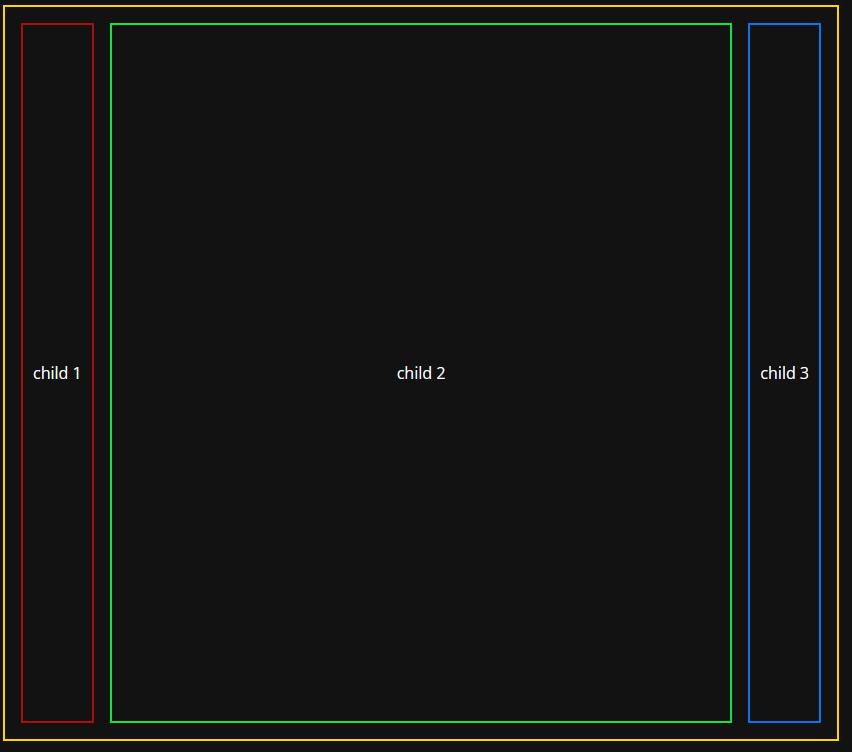

# CSS Grid `auto` property

## grid columns



## To achieve this, use the css below:

```css
.container {
  grid-template-columns: auto 1fr auto;
}
```

## grid rows


## To achieve this, use the css below:

```css
.container {
  grid-template-rows: auto 1fr auto;
}
```

### with child1 and child 3 using the `auto` prop, child 2 should fill the remaining space

## Full CSS

```css
body {
  background-color: #121212;
  color: white;
  font-family: 'Open Sans', sans-serif;
  font-optical-sizing: auto;
}

.container {
  border: 2px solid gold;
  height: 700px;
  width: 800px;
  padding: 16px;

  display: grid;
  grid-template-columns: auto 1fr auto;
  gap: 16px;
}

.centeredflex {
  display: flex;
  align-items: center;
  justify-content: center;
}

.child1 {
  border: 2px solid rgb(172, 14, 14);
  padding: 10px;
}

.child2 {
  border: 2px solid rgb(18, 226, 70);
}

.child3 {
  border: 2px solid rgb(10, 116, 238);
  padding: 10px;
}
```
