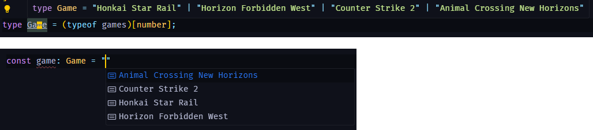

# Convert array values to union

```ts
const games = [
  'Honkai Star Rail',
  'Horizon Forbidden West',
  'Counter Strike 2',
  'Animal Crossing New Horizons',
] as const;

type Game = (typeof games)[number];
```

## need to use `as const` first then `(typeof Type)[number]`



## references

- https://bobbyhadz.com/blog/typescript-create-union-type-from-array
- https://stackoverflow.com/a/55505556
- https://stackoverflow.com/a/45257357
- https://www.reddit.com/r/typescript/comments/nv0icn/is_it_possible_to_create_an_array_union_types_as/?utm_source=share&utm_medium=web3x&utm_name=web3xcss&utm_term=1&utm_content=share_button
