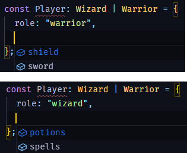

# Discriminated Unions

```ts
type Wizard = {
  role: 'wizard';
  potions: number;
  spells: number;
};

type Warrior = {
  role: 'warrior';
  sword: string;
  shield: string;
};

const Player: Wizard | Warrior = {
  role: 'wizard',
  potions: 12,
  spells: 13,
};
```

## auto intellisense with the role prop



## References

- https://basarat.gitbook.io/typescript/type-system/discriminated-unions
- https://www.typescriptlang.org/docs/handbook/typescript-in-5-minutes-func.html#discriminated-unions
- https://youtu.be/CG3_Y9T03J4
- https://www.youtube.com/watch?v=xsfdypZCLQ8
- https://www.youtube.com/watch?v=9i38FPugxB9
